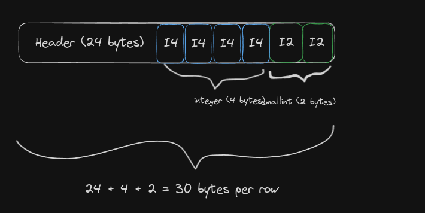
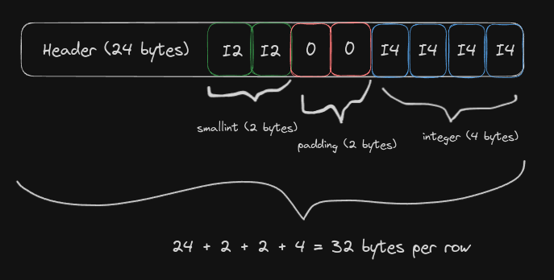
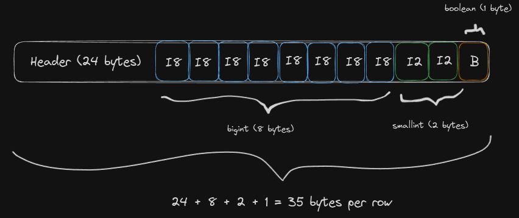
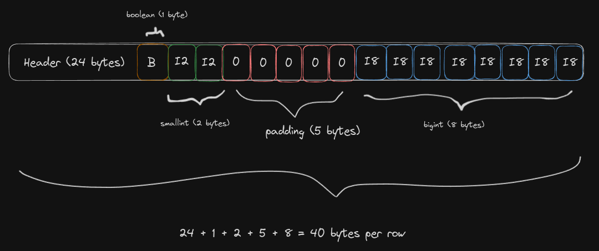

## Introduction

When modeling a Postgres database, you probably don't give much thought to the order of columns in your tables. After all, it seems like the kind of thing that wouldn't affect storage or performance. But what if I told you that simply reordering your columns could reduce the size of your tables and indexes by 20%? This isn't some obscure database trick — it's a direct result of how Postgres aligns data on disk.

In this post, I'll explore how column alignment works in Postgres, why it matters, and how you can optimize your tables for better efficiency. Through a few real-world examples, you'll see how even small changes in column order can lead to measurable improvements.

## Weighing a row

As a direct result of the [table row layout](https://www.postgresql.org/docs/current/storage-page-layout.html#STORAGE-TUPLE-LAYOUT), the smallest possible size for a row is 24 bytes.

```sql
SELECT pg_column_size(ROW());
 pg_column_size
----------------
             24
```

Then, for each new column you add to a row, the more space it will take:

```sql
-- One column of type integer: 24 + 4 = 28 bytes
SELECT pg_column_size(ROW(1::int));
 pg_column_size
----------------
             28

-- Integer + smallint columns: 24 + 4 + 2 = 30 bytes
SELECT pg_column_size(ROW(1::int, 1::smallint));
 pg_column_size
----------------
             30
```

So far so good. That's exactly what you'd expect: the more data you have in your row, the more space in disk it will use. Disk usage is directly proportional to the data types.

In other words, if we have one integer column, we expect the row size to be 24 + 4 = 28 bytes. If we have one integer column and one smallint column, we expect the row size to be 24 + 4 + 2 = 30 bytes.

How can we explain the following output, then?

```sql
SELECT pg_column_size(ROW(1::smallint, 1::int));
 pg_column_size
----------------
             32
```

How is this possible?! We _just_ saw that a `(integer, smallint)` row yields 30 bytes of storage, but a `(smallint, integer)` row costs 32 bytes of disk space! It happens with other data types, too:

```sql
-- (bigint, boolean) = 24 + 8 + 1 = 33 bytes
SELECT pg_column_size(ROW(1::bigint, true::boolean));
 pg_column_size
----------------
             33

-- (boolean, bigint) = 24 + ? + 8 = 40 bytes!?!?
SELECT pg_column_size(ROW(true::boolean, 1::bigint));
 pg_column_size
----------------
             40
```

Rows with `(boolean, bigint)` structure use 21% more disk space than a `(bigint, boolean)` row!

What is going on here?

## Data Alignment

The answer is [**data alignment**](https://en.wikipedia.org/wiki/Data_structure_alignment).

Postgres will happily add padding to the underlying data in order to make sure it is properly aligned at the physical layer. Having the data aligned ensures faster access time when retrieving pages from disk.

> This is actually a [space-time tradeoff](https://en.wikipedia.org/wiki/Space%E2%80%93time_tradeoff): we are adding seemingly wasteful space in order to have faster data access.

### Visual representation

Let's try to visualize what the data would look like on disk. Below is a properly-aligned `(integer, smallint)` row:



Contrast it to the misaligned `(smallint, integer)` row:



Notice how Postgres had to pad the `smallint` column to enforce the necessary alignment of 4 bytes.

Below is another example, now with `(bigint, smallint, boolean)` resulting in a row of 35 bytes.



And the same row, with different order, resulting in 40 bytes per row:



### Calculating alignment boundaries

What determines the alignment used by Postgres? From the [docs](https://www.postgresql.org/docs/current/catalog-pg-type.html):


`typalign` is the alignment required when storing a value of this type. It applies to storage on disk as well as most representations of the value inside PostgreSQL. When multiple values are stored consecutively, such as in the representation of a complete row on disk, **padding is inserted before a datum of this type so that it begins on the specified boundary**. The alignment reference is the beginning of the first datum in the sequence. Possible values are:

- c = char alignment, i.e., no alignment needed.
- s = short alignment (2 bytes on most machines).
- i = int alignment (4 bytes on most machines).
- d = double alignment (8 bytes on many machines, but by no means all).


We can confirm this by querying `pg_type` directly:

```sql
SELECT typname, typalign, typlen
FROM pg_type
WHERE typname IN ('int4', 'int2', 'int8', 'bool', 'varchar', 'text', 'float4', 'float8', 'uuid', 'date', 'timestamp');

  typname  | typalign | typlen
-----------+----------+--------
 bool      | c        |      1
 int8      | d        |      8
 int2      | s        |      2
 int4      | i        |      4
 text      | i        |     -1
 float4    | i        |      4
 float8    | d        |      8
 varchar   | i        |     -1
 date      | i        |      4
 timestamp | d        |      8
 uuid      | c        |     16
```

You can see, for example, that `int8` will require an alignment of `d` (double, or 8 bytes) whereas `int4` needs half the space.

`varchar` and `text` work differently. Even though they have an alignment of `i`, their `typlen` is negative. Why is that? Because they have variable size, i.e. they use a `varlena` structure.

The fact that these two fields have variable length is not really relevant to alignment, except for the fact that such variable column will be aligned in boundaries of 4 bytes (unless the data is TOASTed, as we'll see below).

It's also worth pointing out that the `uuid` type is different. It has a `typlen` of 16 bytes, but it has `c` alignment (meaning it needs no prior alignment). As such, you don't need to worry if you have a `boolean` column right before an `uuid`, for example.

In the Postgres codebase you'll find this value being used in the `MAXALIGN` macro to determine the necessary alignment for fixed-width types.

```c
define TYPEALIGN(ALIGNVAL,LEN)  \
	(((uintptr_t) (LEN) + ((ALIGNVAL) - 1)) & ~((uintptr_t) ((ALIGNVAL) - 1)))

#define MAXALIGN(LEN)			TYPEALIGN(MAXIMUM_ALIGNOF, (LEN))
```

> NOTE: the documentation states that **padding is inserted before [...] this type**. This means that, if we have a structure like `(char, int4, char, int8)` then we will have 3 bytes of padding before `int4` and 7 bytes of padding before `int8`.

### Alignment applies to indexes, too!

What’s often overlooked is that data alignment doesn’t just impact the rows in your tables — it applies to indexes as well. This can be surprising because we typically think of indexes as compact, optimized structures that exist purely to speed up queries. However, Postgres ensures that data in indexes follows the same alignment rules as table rows, which means that misaligned columns can inflate the size of your indexes just as they do with tables.

This is actually how I originally found out about the importance of data alignment in Postgres. I had an `(int8, int8)` index, which I restructured to be `(int4, int8)` to result in a smaller table/index size. Imagine my surprise when I benchmarked and realized the index size did not change at all!

This is a critical point to take home: **misaligned columns affect your indexes too**, potentially increasing both disk usage and memory consumption. Keeping indexes aligned can therefore have a significant impact on database performance and resource efficiency.

### What it looks like in practice

```sql
-- Let's create the first table, which has (int4, int8, int4) structure
CREATE TABLE table_1 (int4_1 INTEGER, int8_2 BIGINT, int4_3 INTEGER);
CREATE INDEX int_4_int_8_int_4 ON table_1 (int4_1, int8_2, int4_3);

-- The second table has a better alignment: (int4, int4, int8)
CREATE TABLE table_2 (int4_1 INTEGER, int4_2 INTEGER, int8_3 BIGINT);
CREATE INDEX int_4_int_4_int_8 ON table_2 (int4_1, int4_2, int8_3);

-- Add 10_000_000 entries to each table
INSERT INTO table_1 (int4_1, int8_2, int4_3) SELECT gs AS int4_1, gs AS int8_2, gs AS int4_3 FROM GENERATE_SERIES(1, 10000000) AS gs;
INSERT INTO table_2 (int4_1, int4_2, int8_3) SELECT gs AS int4_1, gs AS int4_2, gs AS int8_3 FROM GENERATE_SERIES(1, 10000000) AS gs;

-- The first table uses more disk space than the second one
SELECT
  pg_size_pretty(pg_relation_size('table_1')) AS table_1_size,
  pg_size_pretty(pg_relation_size('table_2')) AS table_2_size;

 table_1_size | table_2_size
--------------+--------------
 498 MB       | 422 MB

-- The first index uses more disk (and memory) than the second one
SELECT
  indexrelid::regclass AS index_name,
  pg_size_pretty(pg_relation_size(indexrelid::regclass)) AS index_size
FROM
  pg_stat_user_indexes;

    index_name     | index_size
-------------------+------------
 int_4_int_8_int_4 | 386 MB
 int_4_int_4_int_8 | 300 MB
```

For a single table, with only one misaligned datum, the properly aligned table uses 76 less megabytes (a 15% improvement), and the properly aligned index uses 86 less megabytes (a 22% improvement).

These experimental tables have 10 million entries, which is a small number for real-world databases. Imagine the level of improvement one may find on those databases!


NOTE: It's important to mention that the benefits of a properly aligned table are not exclusive to storage. It will likely lead to **performance gains**, too.

It's intuitively easy to understand why that's the case. With a better data alignment, your rows will be smaller. With smaller rows, you will fit more rows per page. With tightly packed pages:

1. Potentially fewer pages need to be retrieved from disk.
2. Postgres can fit more rows in memory (i.e. more rows for the same number of cached pages)


I don't have the time to measure how much performance would be improved, but I believe the potential performance gains are non-negligible.

### When to start worrying

Friends don't let friends create misaligned tables. But you don't necessarily want to become the alignment police in your company's PR reviews!


Startups, specially early-stage ones, often have a frenetic development process, and saving 10-20% of disk space is usually not a top priority. Quite often, these savings are absolutely irrelevant at this stage. So, when should your team worry about table alignment?

The right answer depends heavily on the context behind your product, but eventually you will notice dramatic infrastructure-related costs (specific to your databases) and maybe that's a good starting point.

However, I hold the opinion that a competent software engineer should always keep this fact in mind and, whenever possible, make adjustments while developing features. No need to fret over it, but try to keep your tables aligned from early on.

This will significantly save _time_ in the future. Refactoring your data model is not easy. It's not only a matter of reordering your table columns, but your indexes too (which also means reordering your query pattern at the application layer).

In fact, for early-stage startups, **my recommendation is to always keep an eye on how well-aligned your _indexes_ are**. You can reorder the actual table columns later on, but pay close attention to your indexes. I think this is a good recommendation because:

1. As mentioned above, indexes are hard to reorder. You'd need to make sure the access pattern is reordered too, since a query on `(a, b)` will not use an index on `(b, a)`.
2. It is easy to change the order of indexes during development, since they are added individually and don't depend on previous migrations.
3. Changing the order of columns during development is hard, though, because they often build upon previous migrations.
4. Refactoring the data model to reorder table columns, while not trivial, does not need application-level changes (unless you are doing something fringe), so it can be postponed to a later stage.

### Rule of thumb

A generic rule of thumb I've been using for the past few years is to, whenever possible, define columns based on a descending order of data types size.

In other words: start with larger data types like `int8`, `float8` and `timestamp`, and place smaller types at the end. This will naturally align your table.

Keep in mind this is an "all else being equal" kind of rule. Other factors, like cardinality or even readability, may have higher priority than data alignment, especially when it comes to indexes.

### A note on TOASTed values

Some data types have variable length and their value may be stored elsewhere if it gets too big to the point that a row would not fit in a single page. When this happens, we say the value is TOASTed. In this scenario, the row will contain a pointer to the underlying data.

Different types of pointer may exist depending on the size of the data. For single-byte pointers, no alignment is necessary, whereas a 4-byte alignment is applied to 4-byte pointers. From the [docs](https://www.postgresql.org/docs/current/storage-toast.html):


Values with single-byte headers aren't aligned on any particular boundary, whereas values with four-byte headers are aligned on at least a four-byte boundary; this omission of alignment padding provides additional space savings that is significant compared to short values.


## Does this apply to other databases?

Do we need to consider data alignment when working with databases other than Postgres? Here's what I found out:

### SQLite

No. Here's a [quote from Richard Hipp](https://sqlite.org/forum/info/5e030d06c5b32ab5y):



SQLite does not pad or align columns within a row. Everything is tightly packed together using minimal space. Two consequences of this design:

1. SQLite has to work harder (use more CPU cycles) to access data within a row once it has that row in memory.
2. SQLite uses fewer bytes on disk, less memory, and spends less time moving content around because there are fewer bytes to move.

We believe that the benefit of #2 outweighs the disadvantage of #1, especially on modern hardware in which #1 is operating out of L1 cache whereas #2 is using main-memory transfers. But your mileage may vary depending on what you store in the database file.



For those familiar with the SQLite architecture, I'd say this is not surprising and well in-line with the SQLite philosophy.

### MySQL

MySQL is not my forte, so you will want to dive deeper to corroborate my findings. I'm only quoting the docs and adding a few thoughts of my own, which I have not verified. You can use the links below as a starting point for your own research.

#### NDB

From [the docs](https://dev.mysql.com/doc/refman/8.4/en/storage-requirements.html#data-types-storage-reqs-ndb):


NDB tables use 4-byte alignment; all NDB data storage is done in multiples of 4 bytes. Thus, a column value that would typically take 15 bytes requires 16 bytes in an NDB table. For example, in NDB tables, the TINYINT, SMALLINT, MEDIUMINT, and INTEGER (INT) column types each require 4 bytes storage per record due to the alignment factor.


Based on the above, I believe padding would be added to columns smaller than 4 bytes.

#### InnoDB

I failed to see a mention of alignment and padding in [chapter 17 of the MySQL docs](https://dev.mysql.com/doc/refman/8.4/en/innodb-storage-engine.html), except maybe for this bit:

> [`innodb_compression_failure_threshold_pct`] [d]efines the compression failure rate threshold for a table, as a percentage, at which point MySQL begins adding padding within compressed pages to avoid expensive compression failures.

Not helpful. It hints to padding at the page level, but we want to know if the columns are individually padded. Well, MySQL is Oracle-open-sourced, so we can look at the code to try to get some hints. Here's an interesting bit from [storage/innobase/row/row0mysql.cc](https://github.com/mysql/mysql-server/blob/596f0d238489a9cf9f43ce1ff905984f58d227b6/storage/innobase/row/row0mysql.cc#L339):

```cpp
/** Pad a column with spaces.
@param[in] mbminlen Minimum size of a character, in bytes
@param[out] pad Padded buffer
@param[in] len Number of bytes to pad */
void row_mysql_pad_col(ulint mbminlen, byte *pad, ulint len) {
  const byte *pad_end;

  switch (UNIV_EXPECT(mbminlen, 1)) {
    default:
      ut_error;
    case 1:
      /* space=0x20 */
      memset(pad, 0x20, len);
      break;
    case 2:
      /* space=0x0020 */
      pad_end = pad + len;
      ut_a(!(len % 2));
      while (pad < pad_end) {
        *pad++ = 0x00;
        *pad++ = 0x20;
      };
      break;
    case 4:
      /* space=0x00000020 */
      pad_end = pad + len;
      ut_a(!(len % 4));
      while (pad < pad_end) {
        *pad++ = 0x00;
        *pad++ = 0x00;
        *pad++ = 0x00;
        *pad++ = 0x20;
      }
      break;
  }
}
```

Okay, clearly something, somewhere is padding columns in the InnoDB storage engine. However, when I grep the MySQL codebase for users of this function, I get the impression it's used only in some special cases (instead of always checking for alignment and padding if necessary, as the Postgres codebase does). For example, it seems it's used only for padding fixed-length CHAR columns (see usage at [row0ins.cc](https://github.com/mysql/mysql-server/blob/596f0d238489a9cf9f43ce1ff905984f58d227b6/storage/innobase/row/row0ins.cc#L587)).

In any case, I urge the reader to try the snippet at the "[What it looks like in practice](#what-it-looks-like-in-practice)" section in MySQL and analyze the results. Something tells me that misaligned tables will not be as big of an issue in MySQL as they are with Postgres.

---

Read the [discussion on Hacker News](https://news.ycombinator.com/item?id=41757940).
