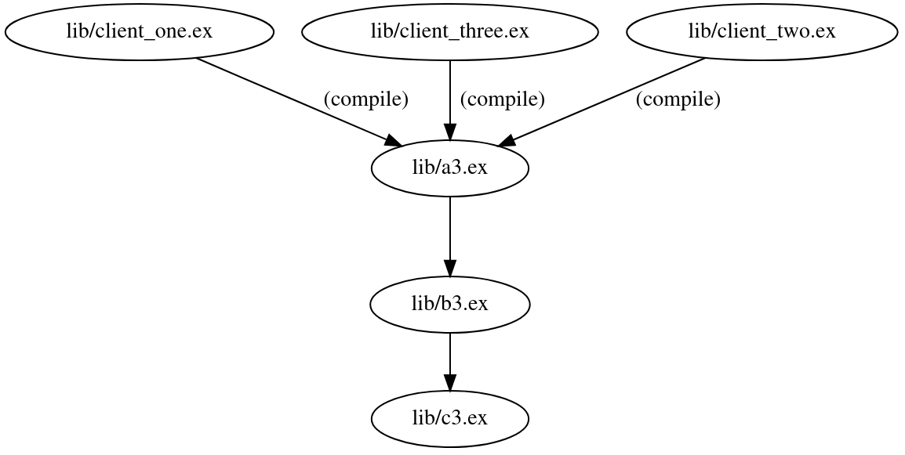

## Recompilation hell: what it feels like

Elixir is an amazing language and it's been a huge privilege being able to work with it for over a decade now (how time flies)!

I'd like to point out an issue that, if overlooked, can severely impact productivity in your team. Yes, I'm talking about module (re)compilation.

You make a few changes to _a single file_ in your codebase and hit recompile. Boom: `Compiling 93 files (.ex)`. Then you make another change and boom: `Compiling 103 files (.ex)`.

We've all been there. There _is_ a solution to this problem. Whether the solution is painful depends on how long this problem has gone unaddressed in your codebase.

If you don't actively fix this, the number of recompiled files will likely grow as your project grows, and the harder it will be to get rid of it.

## Why it matters

Before sharing how to detect, fix and prevent it from ever happening again, I'd like to briefly go over why it matters and why you should _absolutely_ care about this.

The feedback time, that is, the time it takes for a developer to iterate between _making changes_ and _observing the changes_ is the single, most important individual productivity metric you should monitor.

Tighten your feedback loop: if you change one module, ideally only one module should recompile. If you are doing localhost web development, your localhost page should have near-instant page loads. There are exceptions to this, but if you are the exception you are _conscious_ that you are the exception.

## **Step 1: Detecting the issue**

Well, _detecting_ is easy: you change one module and several ones get recompiled? Yep, you are in recompilation hell. But how can you know in which _circle_ of hell are you in?

You can use the most underestimated tool in the Elixir ecosystem!

### A primer on `mix xref`

[`mix xref`](https://hexdocs.pm/mix/1.17.3/Mix.Tasks.Xref.html) is, without a doubt, the most underestimated tool[[0]](#notes) in the Elixir ecosystem. Think of it as being a swiss army knife that provides insights in the relationships between modules in your codebase.

It can help you:

<details>
  <summary>List all compile-time dependencies in a project</summary>
  mix xref graph --label compile
</details>

<details>
  <summary>List all files that depend on foo.ex at compile time</summary>
  mix xref graph --label compile --sink lib/foo.ex --only-nodes
</details>

<details>
  <summary>List all callers of a given module</summary>
  mix xref callers Core.Schemas.Admin
</details>

<details>
  <summary>List every dependency that is linked to a particular file</summary>
  mix xref trace lib/foo.ex
</details>

<details>
  <summary>Generate a graph with all compile-time dependencies</summary>
  mix xref graph --format dot --label compile<br/>
  dot -Tsvg xref_graph.dot -o xref_graph.svg
</details>

## **Step 2: Understanding the issue**

Okay, you know you are in recompilation hell. But do you know _why_ you are in hell? My guess is: you've sinned with macros.

In order to fully comprehend the issue, you will need first to understand the interaction between modules and what creates a compilation dependency.

### Module (re)compilation in Elixir

Let's understand, once and for all, how modules recompile in Elixir.

#### Scenario 1: runtime dependencies

In this first scenario, there are only runtime function calls: A1 calls B1 which calls C1.


```elixir
# lib/a1.ex
defmodule A1 do
  def call_b, do: B1.call_c()
end

# lib/b1.ex
defmodule B1 do
  def call_c, do: C1.do_something()
end

# lib/c1.ex
defmodule C1 do
  def do_something, do: IO.puts("I did something!")
end
```

Here's the output of `mix xref graph`: [[1]](#notes)

```
lib/a1.ex
└── lib/b1.ex
lib/b1.ex
└── lib/c1.ex
lib/c1.ex
```

It tells us that `lib/a1.ex` has a runtime dependency to `lib/b1.ex`, which in turn has a runtime dependency to `lib/c1.ex`, which has no dependencies.

> NOTE: We can tell this is a runtime dependency because the `mix xref` output has no additional information next to the file path. If they were compile-time dependencies, we'd see "lib/a1.ex (compile)" instead.

Recompilation output when changing any of these modules individually:

| lib/a1.ex | lib/b1.ex | lib/c1.ex |
| - | - | - |
| Compiling 1 file | Compiling 1 file | Compiling 1 file |

Runtime dependencies are great because it means that changing _one_ module will require recompilation of only that _one_ module. In an ideal world, every module in your codebase would only depend on other modules at runtime.

#### Scenario 2: compile-time dependencies

Alas, we don't live in an ideal world. Let's simulate a compile-time dependency

```elixir
# lib/a2.ex
defmodule A2 do
  @b B2
  def call_b, do: @b.say_hello()
end

# lib/b2.ex
defmodule B2 do
  @person C2.get_person()
  def say_hello, do: IO.puts("Hello #{@person}")
end

# lib/c2.ex
defmodule C2 do
  def get_person, do: :mike
end
```

As you probably know, module attributes are evaluated at compile-time (this is actually why you should use `Application.compile_env/3` in module attributes). What that means for the code above is that:

- The `@b` attr in `A2` holds an `:Elixir.B2` atom that references the `B2` module
- The `@person` attr in `B2` holds the `:mike` atom, which came from the call to `C2.get_person/0`

Elixir quiz time: which modules above will have a compilation-time dependency?

<details>
  <summary>Click to see output of <code>mix xref graph</code></summary>
  <code>
  lib/a2.ex<br/>
  └── lib/b2.ex</br>
  lib/b2.ex</br>
  └── lib/c2.ex (compile)</br>
  lib/c2.ex
  </code>
</details>

As one would expected, `B2` depends on `C2` during compile-time, since if we modify the result of `C2.person/0` to be,
ahem, `:joe`, `B2` will need to be re-compiled so that the `@person` module attribute can be re-evaluated.

Somewhat surprisingly, `A2` does _not_ have a compile-time dependency on `B2`. The compiler is smart enough to track that _any_ changes in the `B2` module would never cause the `@b` value to change.

Recompilation output when changing any of these modules individually:

| lib/a2.ex | lib/b2.ex | lib/c2.ex |
| - | - | - |
| Compiling 1 file | Compiling 1 file | Compiling 2 files |

Should we worry about these compile-time dependencies? Personally, I wouldn't worry too much until they become a noticeable issue. They may become noticeable when you start, for example, calling a particular function from a module attribute across several modules.

The reason I wouldn't bother _initially_ is that this kind of compile-time dependency is usually easy to resolve. So go ahead, let your codebase evolve and grow, and if you get any sharp edges you can fix them later on.

Of course, that doesn't mean you can be negligent about this. When writing or reviewing code, always pay extra attention to module attributes. If you see a compilation dependency that has the potential to become nasty in the future &mdash; or that can be easily removed right away &mdash; go ahead and save yourself from future headaches.

#### Scenario 3: transitive compile-time dependencies

The third scenario I'd like to showcase is when your code has _transitive_ compile-time dependencies. If you are suffering from recompilation pain, you are likely hitting this scenario.

Below is the smallest demo I could think of:

```elixir
defmodule A3 do
  @runtime_dependency_on_b B3
  def foo, do: :foo
end

defmodule B3 do
  @runtime_dependency_on_c C3
end

defmodule C3 do
end

defmodule ClientOne do
  @compile_time_dependency_on_a A3.foo()
end

defmodule ClientTwo do
  @compile_time_dependency_on_a A3.foo()
end

defmodule ClientThree do
  @compile_time_dependency_on_a A3.foo()
end
```

You have three "clients". Clients are simply users of `A3` (with a regular compile-time dependency). `A3` then has a runtime dependency on `B3`, which also has a runtime dependency on `C3`. That doesn't sound too bad, right? Most importantly, it seems to be a regular occurrence in any given codebase.

> Here, what I meant by "client" is that there may be several instances using `A3`. Think events or endpoints or jobs, each of which with a compile-time dependency to their "core" implementation.

This is what the compilation graph for these modules looks like:



Looking at the graph above, we expect that changes to `lib/a3.ex` will cause all N clients of it to be recompiled. Indeed, that's exactly what happens. But what would you expect to be recompiled if you were to change `lib/c3.ex`?

Only `C3`, right? Yes, me too. But here's what happens when I change `C3`:

```
Compiling 4 files (.ex)
Compiled lib/c3.ex
Compiled lib/client_three.ex
Compiled lib/client_two.ex
Compiled lib/client_one.ex
```

Ouch, not good. What we are witnessing here is _transitive_ compile-time dependencies in action.

| lib/client_one.ex | lib/a3.ex | lib/b3.ex | lib/c3.ex |
| - | - | - | - |
| Compiling 1 file | Compiling 4 files | Compiling 4 files | Compiling 4 files |

While my minimal example seems out of touch from reality, usually you will hit this scenario when:

1. You have a `Core.Event` implementation with a macro
2. You have multiple `Event.MyEventName` modules that use macros from `Core.Event`
3. You call `Services.Log` from within the macro
4. You call `Services.User` from within `Services.Log`
5. You call `Schemas.User` from within `Services.User`

Every time you change your user schema, you are also recompiling every single one of your events.

Now imagine you follow a similar pattern with endpoints, job definitions, schemas, authorization, error handling, data validation, analytics. You can easily find yourself in a scenario where everything is tangled in a web of modules. One change basically recompiles every single module in your codebase.

> This is the worst! This is the eight circle of hell! It has the potential to bring your productivity down by multiple orders of magnitude! Do yourself (and your team) a favor and get rid of them &mdash; or monitor them _closely_ so they don't grow inadvertently.

In practice, the worst offenders of this are macros. You might be affected even if you don't write macros yourself: "macro-heavy" libraries, in particular, are prone to transitive dependencies (Absinthe is worth mentioning by name: _every_ codebase I've seen using Absinthe suffers from this).

## **Step 3: Fixing the issue**

At this point, you know you are in hell, and more importantly you know why you are in hell. How can you get out, then? It basically boils down to two simple steps:

1. Identifying the offending modules in key or common areas of your codebase; and
2. Refactoring them to not create compile-time dependencies.

Will this be difficult? It depends on how "spaghettified" your modules are. If you have a big ball of mud, untangling your dependencies is likely to be painful.

> No matter how difficult this task turns out to be, however, I can guarantee you it's definitely worth the effort. And once untangled, if you keep reading this blog post until the end, you will learn what you have to do to prevent transitive dependencies from ever happening again.

### Identifying transitive dependencies

Let's go! First, you will need to identify what are the affected modules.

The easiest thing you can do is:

1. Modify a module that triggers several other modules to recompile.
2. Run `mix compile --verbose`.

Now you have a list of every module that was recompiled.

But we can do better than that! We can get the full "path" between two files using `mix xref`. This will make it substantially easier for you to understand exactly where the tangling is happening:

`mix xref graph --source SOURCE --sink TARGET`

> Here, `TARGET` is the file you changed and triggered recompilation of several unrelated files, and `SOURCE` is the module you think (or know) is starting the compilation chain. If you don't know which module is the `SOURCE`, simply use the last file shown in the `mix compile --verbose` command you ran above. It is likely the `SOURCE` you want.

Below is the output for [Scenario 3](#scenario-3-transitive-compile-time-dependencies) discussed previously:

```
lib/client_one.ex
└── lib/a3.ex (compile)
    └── lib/b3.ex
        └── lib/c3.ex
```

In the example above, if you can either remove the compilation dependency between `client_one.ex` and `a3.ex` or remove the runtime dependency between `a3` and `b3`, you will break the compilation chain.

### Getting rid of compile-time dependencies

You have identified the compilation chain and now you need to break it. Below you will find a few strategies that you can use to refactor the offending modules.

#### Strategy 1: Move macros to dedicated modules with no additional dependencies

Initially, we have a `Core.Event` module that has both the macros and the generic functions that may be used by events.

```elixir
# lib/strategy_1/before/event_user_created.ex
defmodule S1.Before.Event.UserCreated do
  use S1.Before.Core.Event
  @name :user_created_event

  def new(user_id), do: %{user_id: user_id}
end

# lib/strategy_1/before/core_event.ex
defmodule S1.Before.Core.Event do
  defmacro __using__(_) do
    quote do
      alias __MODULE__
      @before_compile unquote(__MODULE__)
    end
  end

  defmacro __before_compile__(_) do
    quote do
      @name || raise "You must specify the event name via @name"
      def get_name, do: @name
    end
  end

  def emit(%{id: id, data: _data}),
    do: S1.After.Services.Log.info("Emitting event_id=#{id}")
end

# lib/strategy_1/before/service_log.ex
defmodule S1.Before.Services.Log do
  def info(value), do: IO.puts("[info] #{value}")
end
```

Notice how `Services.Log` ends up as part of the compilation chain simply because it is part of the `Core.Event` module, even though it plays no special role in the macro itself. The command below tells us that there exists a transitive dependency (`mix ref` refers to them as "compile-connected") between `event_user_created.ex` and `core_event.ex`

```
> mix xref graph --label compile-connected | grep before

lib/strategy_1/before/event_user_created.ex
└── lib/strategy_1/before/core_event.ex (compile)
```

This strategy consists in breaking `Core.Event` into two parts: `Core.Event.Definition` with the macros and `Core.Event` with shared functions.

```elixir
# lib/strategy_1/after/core_event.ex
defmodule S1.After.Core.Event do
  def emit(%{id: id, data: _data}),
    do: S1.After.Services.Log.info("Emitting event_id=#{id}")
end

# lib/strategy_1/after/core_event_definition.ex
defmodule S1.After.Core.Event.Definition do
  defmacro __using__(_) do
    quote do
      alias Core.Event
      @before_compile unquote(__MODULE__)
    end
  end

  defmacro __before_compile__(_) do
    quote do
      @name || raise "You must specify the event name via @name"
      def get_name, do: @name
    end
  end
end
```


One thing to keep in mind here is that your `Definition` module should _not_ have compile-time dependencies to other parts of your application, otherwise you are back to square one.

If you can't get around calling another module within your codebase, try to follow the same pattern: make sure to extract the necessary functions into a dedicated module. The goal is to _isolate_ the functions needed by the macro into their own modules.

By applying this strategy, we are now free of transitive dependencies:

```
> mix xref graph --label compile-connected | grep after

(empty output, meaning there are no transitive dependencies)
```

You can find the [full example in Github](https://github.com/renatomassaro/elixir_recompilation_sandbox/tree/main/lib/strategy_1).

#### Strategy 2: Reference the module during runtime (Absinthe example)

This strategy (*ahem* hack) consists in referencing the module during runtime execution, in order to break the chain between `queries.ex` and `resolver.ex`.

```elixir
# lib/strategy_2/before/queries.ex
defmodule S2.before.queries do
  use Absinthe.Schema.Notation

  object :queries do
    field :user, :user do
      arg(:id, :integer)

      # We are calling the resolver directly, as any sane person would
      resolve(&S2.Before.Resolver.query_user/3)
    end
  end
end
```

Here's the alternative:

```elixir
# lib/strategy_2/after/queries.ex
defmodule S2.After.Queries do
  use Absinthe.Schema.Notation

  object :queries do
    field :user, :user do
      arg(:id, :integer)

      resolve(fn parent, args, resolution ->
        # Here, we remove the compile-time reference by building
        # the resolver module dynamically
        resolver().query_user(parent, args, resolution)
      end)
    end
  end

  # Either option below works
  defp resolver, do: :"Elixir.S2.Before.Resolver"
  # defp resolver, do: Module.concat(S2.Before, Resolver)
end
```

But Renato, is it safe? Can't this cause some module being stale due to it not recompiling? This is a good question. And I don't have a good answer, except that I've been using this ~~hack~~ strategy for _at least_ 8 years and don't remember a single instance where it caused inconsistencies.

The downsides of this approach are:

1. Worse code readability, since you are doing something unexpected.
2. Worse performance, since you are requiring additional function calls.

Are the downsides worth the advantage of not having a compilation chain? Almost always, yes! The degraded readability can be abstracted away (as can be seen in the example). The performance overhead is negligible in most cases (a single SQL query will be at least 10,000x slower).

> This strategy is particularly useful for Absinthe: when you break the chain between your queries/mutations and resolvers, you are effectively shielding yourself from transitive dependencies that could potentially impact your entire codebase!

You can find the [full example in Github](https://github.com/renatomassaro/elixir_recompilation_sandbox/tree/main/lib/strategy_2).

#### Strategy 3: Keep macros simple

My third strategy is that, whenever possible, keep your macros simple. In other words, make sure they only reference built-in modules and/or 3rd-party libraries.

> If your macro absolutely needs to call some of your own code, then try to _isolate_ that particular code into a single, dedicated module with no external dependencies (this is [Strategy 1](#strategy-1-move-macros-to-dedicated-modules-with-no-additional-dependencies), actually).

#### Strategy 4: Don't use macros

Macros are tempting, I know. Can you _not_ use them at all? If that's a valid option, I recommend you take it.

Macros have the downsides of making code harder to read, harder to test, harder to document, less intuitive and less idiomatic. On the other hand, they have the positives of reducing boilerplate and ensuring consistency and conventions across a codebase.

If you actually _need_ them, make sure you keep them simple ([Strategy 3](#strategy-3-keep-macros-simple)).

## **Step 4: Preventing it from ever happening again**

After a lot of work, you managed to get rid of compilation chains! Congratulations! Your co-workers will be very grateful for your refactor.

### Detecting transitive dependencies in your CI pipeline

First, you need to know how many chains you currently have:

```
mix xref graph --label compile-connected | grep "(compile)" | wc -l
```

Above command will tell you the number of `compile-connected` (transitive) dependencies you have.

Then, you can apply the following verification in your pipeline:

```
- name: Check for transitive compilation dependencies
  run: mix xref graph --label compile-connected --fail-above NUMBER
```

Replace `NUMBER` with your current (or target) number of transitive dependencies in your codebase. Your goal should be zero.

Following this method, you will prevent:

- new chains from showing up.
- existing chains from growing up.

> Wait! You do have a CI pipeline, right? If you don't have one but you are using Github, just add [this basic workflow template](https://github.com/renatomassaro/elixir_recompilation_sandbox/blob/main/.github/workflows/ci.yaml). It compiles, tests, checks formatting and transitive dependencies. That's a good starting point. Github Actions is free, including private repositories.

## Worth mentioning

### Pattern-matching on structs no longer creates compile-time dependencies

If you've been working with Elixir for several years, you might remember this used to be a problem in the past:

```elixir
defmodule Services.User do
  alias Schemas.User

  def query(%User{id: id}) do
    # ...
  end
end
```

Above code would create a compile-time dependency between `Services.User` and `Schemas.User`. Since Elixir 1.11 (~2020) this is [no longer the case](https://hexdocs.pm/elixir/1.11.0/changelog.html#compilation-time-improvements). Now, this kind of pattern-match creates an "export" dependency, which will only trigger a recompilation if the _struct_ of `Schemas.User` changes.

> **Takeaway**: don't be afraid of aliasing and pattern-matching against a struct. It makes your code better, safer, easier to read and won't cause unnecessary compile-time dependencies.

### Don't (blindly) rely on `mix xref` for boundaries

As you saw in [Strategy 2](#strategy-2-reference-the-module-during-runtime-absinthe-example), a module can reference another dynamically. When that happens `mix xref` is _not_ able to tell you that `A` may be calling `B`.

> **Takeaway**: don't blindly trust the `mix xref` output, especially if you are trying to enforce security/boundaries across modules.

### Visualizing your dependencies with `DepViz` and `Graphviz`

There's this amazing tool that you should use right now: [DepViz](https://github.com/axelson/dep_viz).

1. Simply go to [https://depviz.jasonaxelson.com/](https://depviz.jasonaxelson.com/).
2. Generate your `.dot` file with `mix xref graph --format dot`.
3. Upload and visualize your clean, well-organized module structure.

Alternatively, you can simply use [Graphviz](https://graphviz.org):

1. Generate your `.dot` file with `mix xref graph --format dot`.
2. Generate a `.svg` of your graph with `dot -Tsvg xref_graph.dot -o xref_graph.svg`.
3. Open it in your browser (or whatever) and visualize your module hierarchy.

## Conclusion

Whether you are a CTO, a tech lead or an individual contributor in a team, please, for your own sake, pay attention to your feedback loop.

When starting a new project, an experienced engineer will keep a close eye on this, for they know how important it is in the long term to have a _fast_ loop. However, less experienced engineers, or experienced engineers who don't have a lot of experience with Elixir might not realize they are hurting the feedback loop until it gets too late.

Optimize the feedback loop your developers (or you) go through on a daily basis. I insist: when it comes to productivity, this is the first metric you should care about.

This blog post should contain everything you need to identify and permanently fix (re)compilation issues with your codebase. However, if you have questions or comments, feel free to [reach out to me via email](mailto:r@ena.to).

---

## Notes

[0] - If you disagree with this assertion, _please_ shoot me an email. I'd love to hear what _you_ consider to be more underestimated than `mix xref`. [^](#a-primer-on-mix-xref)

[1] - This originally read `mix xref --graph`; however, the correct command is `mix xref graph`. Thanks to Sam Weaver (and team) for pointing out this issue! [^](#scenario-1-runtime-dependencies)
